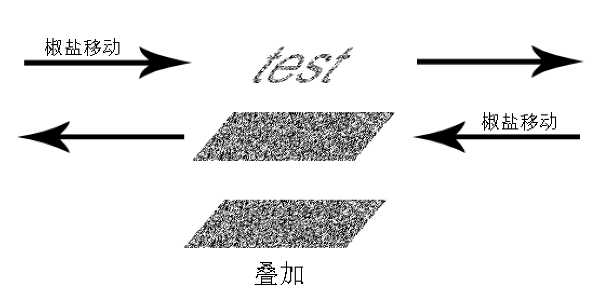

# Dynamic Salt and Pepper Captcha

[](https://choosealicense.com/licenses/gpl-3.0/) [](https://www.python.org/)

中文版文档请参见 [README.md](README.md)

## Introduction
&nbsp;&nbsp;&nbsp;&nbsp;

I have seen some videos on the Internet, such as playing a certain video with dynamic salt and pepper images. If you pause, you can't see the content. If dynamic salt and pepper images are used to generate captcha, it can avoid being recognized by ordinary captcha recognition tools and increase interest.

The mainstream verification code recognition method is static letter similarity comparison, but the information expressed by the captcha is hidden in the dynamic changes. Therefore, most of the current methods for automatic identification of captcha can not be recognized. However, it is also not difficult to develop this verification code recognition tool. Only the difference value of dynamic frame is calculated before recognition and converted into static frame.

## Clone
You can use the following command line clone for this project
```shell
git clone https://gitee.com/mmdjiji/dspv-code
```

## Run
This project uses Python to generate this dynamic captcha. Open source library opencv is used for image processing, imageio is used for GIF suppression, and pip is used for installation.

```shell
pip install opencv-python
pip install imageio
```

Or directly based on `requirements.txt` to install the requirements
```shell
pip install -r requirements.txt
```

## Principle



Generation of sub frame salt and pepper image: the captcha text is generated into a graphic mask, and then two layers of pure salt and pepper noise are generated respectively. The top salt and pepper image is covered on the mask, and then superimposed with the bottom salt and pepper image to get the sub frame salt and pepper image. Moving the top and bottom salt and pepper noise in the opposite direction, storing in frames and merging them into a dynamic image, the dynamic salt and pepper verification code can be obtained.

```python
for i in range(0, 200):
  dst = background.copy()
  cover_salt(topfloor, mark, dst)
  move_salt_left(background)
  move_salt_right(topfloor)
  frames.append(dst)
```

In order to facilitate the display of shapes other than letters in captcha in the future, the `shape` layer is used to store the shape layer to be displayed, but it is not output and is only used for temporary storage. In the merging process, the shape layer is used to filter the data at the top layer and overlay it on the bottom layer. As shown in the figure, the effect of the superimposed image is not obvious, which is the characteristic of the salt and pepper captcha, that is, the static frame cannot be recognized. Only when the image "moves" can the text of the verification code be recognized.

## Open Source
This project is based on [GPLv3.0 License](https://choosealicense.com/licenses/gpl-3.0/) to open source.