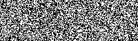

# 动态椒盐验证码

[](https://choosealicense.com/licenses/gpl-3.0/) [](https://www.python.org/)

For english version, please read [README.en.md](README.en.md)

## 简介
<center>&nbsp;&nbsp;&nbsp;&nbsp;</center>

在网上看到过一些视频，比如用动态椒盐图像来播放某种视频，暂停就无法看到内容。如果用动态椒盐图像来生成验证码的话，就可以避免被普通的验证码识别工具识别，同时增加趣味性。

主流的验证码识别方法是静态字母相似度比较，但这种验证码表达的信息隐含在动态变化中。因此，目前的大多数自动识别验证码的方法无法识别。不过，要研发这种验证码识别工具同样不难，只需在识别前先将动态帧的差值求出，转化为静态帧即可。

## 下载
可以使用如下命令行clone本项目
```shell
git clone https://gitee.com/mmdjiji/dsp-captcha
```

## 运行
本项目使用Python来生成这种动态验证码。图像处理使用开源库OpenCV，压制gif使用imageio，可使用pip安装。

```shell
pip install opencv-python
pip install imageio
```

或直接根据 `requirements.txt` 安装依赖
```shell
pip install -r requirements.txt
```

## 原理


生成分帧椒盐图像：将验证码文字生成图形蒙版，再分别生成两层纯椒盐噪声，将顶层的椒盐覆盖到蒙版上，再与底层的椒盐叠加，即可得到分帧椒盐图像。将顶层与底层椒盐噪声向相反方向移动，将分帧存储，合并为一个动态图像，即可获得动态椒盐验证码。

```python
for i in range(0, 200):
  dst = background.copy()
  cover_salt(topfloor, mark, dst)
  move_salt_left(background)
  move_salt_right(topfloor)
  frames.append(dst)
```

为了方便以及以后可以在验证码中显示除字母以外的形状，故单独使用 `shape` 图层来存要显示的形状层，但并不输出，只是作为临时存储需要。在合并时用形状层筛选顶层的数据，叠加到底层上即可。如图所示，这里叠加后的图片效果不明显是椒盐验证码的特性，即静帧无法识别，只有当图像“动”起来的时候才能识别到验证码的文字。

## 开源
本项目以 [GPLv3.0协议](https://choosealicense.com/licenses/gpl-3.0/) 开源。